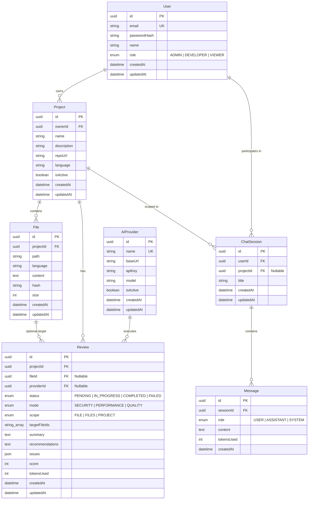

# 🏛️ AI Code Review Assistant — System Architecture & Design

This document details the end-to-end software architecture, component hierarchy, data models, AI integration pipelines, and deployment topology of the **AI Code Review Assistant**.

---

## 1. High-Level System Architecture

```
                                  USER BROWSER
                                       │
                    ┌──────────────────┴──────────────────┐
                    │                                     │
                    ▼                                     ▼
        ┌───────────────────────┐             ┌───────────────────────┐
        │  Next.js 14 Frontend  │             │    Next.js API Route  │
        │  (SSR + Client UI)    │             │  (/api/auth/login,    │
        │  middleware.ts Auth   │             │   /api/auth/logout)   │
        └───────────┬───────────┘             └───────────┬───────────┘
                    │                                     │
                    │   HTTP REST + JWT Bearer / Cookie   │
                    └──────────────────┬──────────────────┘
                                       │
                                       ▼
                    ┌─────────────────────────────────────┐
                    │       NestJS Backend API Gateway    │
                    │  (Port 3000 • Global Prefix /api/v1)│
                    └──────────────────┬──────────────────┘
                                       │
        ┌───────────────┬──────────────┼──────────────┬───────────────┐
        ▼               ▼              ▼              ▼               ▼
 ┌─────────────┐ ┌─────────────┐ ┌───────────┐ ┌─────────────┐ ┌─────────────┐
 │ AuthModule  │ │ProjectsMod. │ │ FilesMod. │ │ ReviewsMod. │ │  ChatModule │
 └──────┬──────┘ └──────┬──────┘ └─────┬─────┘ └──────┬──────┘ └──────┬──────┘
        │               │              │              │               │
        └───────────────┴───────┬──────┴──────────────┴───────────────┘
                                │
                        ┌───────▼───────┐
                        │ Prisma Service│
                        └───────┬───────┘
                                │
        ┌───────────────────────┴───────────────────────┐
        ▼                                               ▼
┌───────────────┐                             ┌───────────────────┐
│  PostgreSQL   │                             │     AIModule      │
│  Database     │                             │ (OpenAI SDK Layer)│
└───────────────┘                             └─────────┬─────────┘
                                                        │
                         ┌──────────────────────────────┼──────────────────────────────┐
                         ▼                              ▼                              ▼
                 ┌───────────────┐              ┌───────────────┐              ┌───────────────┐
                 │    OpenAI     │              │   LM Studio   │              │    Ollama     │
                 │   (Cloud API) │              │  (Local :1234)│              │ (Local :11434)│
                 └───────────────┘              └───────────────┘              └───────────────┘
```

---

## 2. Frontend Architecture (Next.js 14 App Router)

The frontend is built with **Next.js 14 (App Router)** and **Tailwind CSS**, designed with a responsive dark IDE aesthetic.

### Component & Page Hierarchy

```
src/
├── app/
│   ├── layout.tsx                 # Root layout with dark theme & persistent Navbar
│   ├── globals.css                # Tailwind directives, theme variables, scrollbar styles
│   ├── page.tsx                   # Smart redirect: /projects (if logged in) or /login
│   ├── (auth)/
│   │   ├── login/page.tsx         # Sign-in form with error alerts and cookie session dispatch
│   │   └── signup/page.tsx        # Registration form with auto-login redirection
│   ├── projects/
│   │   ├── page.tsx               # Projects grid, search, and "New Project" modal
│   │   └── [id]/
│   │       ├── page.tsx           # IDE workspace: FileTree + FilePreview + Review UI
│   │       └── chat/
│   │           └── page.tsx       # AI Pair Programmer Chat: FileTree + ChatPanel
│   └── api/
│       └── auth/
│           ├── login/route.ts     # Proxies login to backend and sets httpOnly access_token cookie
│           └── logout/route.ts    # Clears auth cookies
├── components/
│   ├── navbar.tsx                 # Top navigation with active route highlights & logout
│   ├── files/
│   │   ├── file-tree.tsx          # Recursive folder/file directory tree
│   │   ├── file-preview.tsx       # Line-numbered code viewer with copy actions
│   │   └── file-upload.tsx        # Drag-and-drop file upload with staged preview
│   ├── reviews/
│   │   ├── review-form.tsx        # Modal to configure review mode & file scope
│   │   ├── review-detail.tsx      # Health score gauge, severity counters, issues table
│   │   └── review-history.tsx     # Past audits history list with filter tabs
│   └── chat/
│       ├── chat-panel.tsx         # State manager, RAG context badge, session controls
│       ├── message-list.tsx       # Formatted chat turns with code block syntax rendering
│       └── chat-input.tsx         # Auto-growing textarea with quick prompt chips
└── lib/
    ├── api.ts                     # Generic type-safe fetch wrapper with credentials
    └── types.ts                   # Core TypeScript interfaces (User, Project, File, Review)
```

### Authentication Flow (Middleware & `httpOnly` Cookies)

1. **Sign In**:
   - User inputs credentials on `/login`.
   - Client sends credentials to Next.js route handler `POST /api/auth/login`.
   - Route handler calls NestJS backend `POST /api/v1/auth/login`.
   - Upon receiving `{ access_token, user }`, the route handler writes an `httpOnly`, `SameSite=Lax`, `Secure` cookie named `access_token` with a 7-day TTL.
2. **Edge Route Protection (`middleware.ts`)**:
   - Runs before every incoming request matching `/projects/:path*`, `/dashboard/:path*`, `/login`, `/signup`.
   - If token is missing and accessing a protected route (`/projects/*`), redirects to `/login?from=<pathname>`.
   - If token exists and accessing an auth route (`/login`, `/signup`), redirects to `/projects`.
3. **API Client (`apiClient`)**:
   - Configured with `credentials: 'include'` so cookies are automatically sent to the backend during CORS requests.
   - Optionally accepts explicit Bearer tokens when called from server-side components.

---

## 3. Backend Architecture (NestJS)

The backend follows NestJS modular architecture with separation of concerns between Controllers (HTTP parsing/validation), Services (business logic), and Repositories (Prisma ORM).

```
src/
├── app.module.ts                  # Root module: registers ThrottlerGuard, ConfigModule, modules
├── prisma/
│   ├── prisma.service.ts          # Singleton PrismaClient lifecycle manager
│   └── prisma.module.ts           # Global module exporting PrismaService
├── auth/
│   ├── auth.module.ts             # JWT module, Passport strategies, registers JwtAuthGuard globally
│   ├── auth.service.ts            # Password hashing (bcrypt) & JWT issuance
│   ├── auth.controller.ts         # Public endpoints: /auth/register, /auth/login
│   ├── guards/jwt-auth.guard.ts   # Global guard honoring @Public() metadata
│   ├── strategies/jwt.strategy.ts # Passport JWT strategy extracting Bearer token
│   └── decorators/                # @Public() and @CurrentUser() decorators
├── projects/
│   ├── projects.module.ts
│   ├── projects.service.ts        # CRUD for projects scoped to req.user.id
│   └── projects.controller.ts     # GET /projects, POST /projects, GET /projects/:id, DELETE
├── files/
│   ├── files.module.ts
│   ├── files.service.ts           # Multipart upload parsing, SHA-256 deduplication
│   ├── files.controller.ts        # POST /projects/:projectId/files, GET /files/:id
│   └── multer.config.ts           # Multer memory storage and file size limits
├── reviews/
│   ├── reviews.module.ts
│   ├── reviews.service.ts         # AI review orchestrator, scope resolver, JSON validator
│   ├── reviews.controller.ts      # POST /reviews, GET /projects/:projectId/reviews, GET /reviews/:id
│   └── prompts/review-prompts.ts  # System prompts for Security, Performance, and Quality
├── chat/
│   ├── chat.module.ts
│   ├── chat.service.ts            # Heuristic RAG code context retriever & chat manager
│   ├── chat.controller.ts         # POST /chat/sessions, POST /chat/sessions/:id/messages
│   └── prompts/chat-prompts.ts    # Codebase context injection templates
└── ai/
    ├── ai.module.ts
    ├── ai.service.ts              # Active provider resolution & chatCompletion dispatcher
    ├── ai.provider.ts             # AIProvider and AIProviderConfig interfaces
    └── providers/
        ├── base-openai-compatible.provider.ts # Abstract client using official openai SDK
        ├── openai.provider.ts                 # OpenAI cloud adapter (gpt-4o)
        ├── lmstudio.provider.ts               # LM Studio local adapter (:1234)
        └── ollama.provider.ts                 # Ollama local adapter (:11434)
```

### Core Backend Capabilities

1. **Global Guards & Throttling**:
   - `JwtAuthGuard` is registered globally as `APP_GUARD`. All routes require authentication unless decorated with `@Public()`.
   - `ThrottlerGuard` protects all endpoints with dual rate limits: 10 req/sec short burst, 200 req/min long sustained.
2. **File Processing Pipeline**:
   - Multer intercepts files into memory buffer.
   - Computes SHA-256 hash of content. If a file with the same path and hash already exists in the project, it skips redundant DB writes.
   - Infers programming language automatically using file extension mappings.
3. **Structured Review Engine**:
   - Synchronously or asynchronously processes review requests.
   - Enforces strict JSON schema generation using `response_format: { type: 'json_object' }`.
   - Validates required fields, sanitizes severity ratings (`Critical`, `High`, `Medium`, `Low`), and calculates weighted health scores.

---

## 4. Database Schema & Entity Relationships

The data layer uses PostgreSQL managed through Prisma ORM. All primary keys use UUID v4.



### Relational Integrity Rules
- **Cascade Deletes**: Deleting a `User` cascades to their `Projects` and `ChatSessions`. Deleting a `Project` cascades to all associated `Files`, `Reviews`, and `ChatSessions`.
- **SetNull on File Delete**: If a `File` is deleted, related `Review.fileId` is preserved and set to `null` to maintain historical audit integrity.
- **Unique Constraints**:
  - `User.email` is unique across the system.
  - `[projectId, path]` is unique in the `File` table.
  - `AIProvider.name` is unique.

---

## 5. AI Integration & Prompt Engineering Flow

```
User Request (Review or Chat)
             │
             ▼
   AIService.getActiveProvider()
             │
             ├─► 1. Check PostgreSQL AIProvider table WHERE isActive = true
             │
             └─► 2. Fallback to Environment Variables (AI_BASE_URL, AI_MODEL, AI_API_KEY)
             │
             ▼
   Select Concrete Adapter:
   • OpenAIProvider (https://api.openai.com/v1)
   • LMStudioProvider (http://localhost:1234/v1)
   • OllamaProvider (http://localhost:11434/v1)
             │
             ▼
   Assemble Context & Prompts:
   • Reviews: Mode-specific system instructions + Target files code blocks
   • Chat (RAG): Filename matching OR Key files fallback + History + User query
             │
             ▼
   BaseOpenAICompatibleProvider.chatCompletion()
   • Invokes OpenAI SDK chat.completions.create()
   • Sets response_format: json_object (for reviews)
   • Temperature: 0.2 (reviews) / 0.7 (chat)
             │
             ▼
   Parse & Sanitize Output ──► Persist in DB (Review / Message)
```

### Review Engine Output Schema
The AI is instructed to return strictly valid JSON conforming to:

```typescript
interface ReviewOutputSchema {
  summary: string;
  issues: Array<{
    severity: 'Critical' | 'High' | 'Medium' | 'Low';
    title: string;
    description: string;
    file: string;
    line?: number | null;
  }>;
  recommendations: string;
}
```

### Heuristic RAG Strategy (Chat Assistant)
1. **Query Token Parsing**: Scans user query for matches against all indexed project filenames or relative paths.
2. **Path Matching**: If a file path or basename is detected in the prompt (e.g., `auth.service.ts`), that exact file's content is injected into the context.
3. **Key Files Fallback**: If no specific file is mentioned, the engine injects:
   - Complete project directory tree.
   - High-value architectural files (`package.json`, `schema.prisma`, `main.ts`, `app.module.ts`, `Dockerfile`).
4. **Token Protection**: Enforces an upper character ceiling (24,000 characters) to prevent exceeding LLM context windows.

---

## 6. Deployment Topology

### Production Deployment Architecture

```
                                  INTERNET
                                     │
                 ┌───────────────────┴───────────────────┐
                 │                                       │
                 ▼                                       ▼
        ┌─────────────────┐                     ┌─────────────────┐
        │     Vercel      │                     │ Render / Railway│
        │ Next.js Frontend│                     │ NestJS Backend  │
        │ (Edge Network)  │                     │ (Docker/Node)   │
        └────────┬────────┘                     └────────┬────────┘
                 │                                       │
                 │              Private VPC              │
                 └───────────────────┬───────────────────┘
                                     │
                         ┌───────────┴───────────┐
                         ▼                       ▼
                ┌─────────────────┐     ┌─────────────────┐
                │ Managed Postgres│     │ Cloud AI APIs   │
                │ (Neon/Supabase) │     │ (OpenAI/Azure)  │
                └─────────────────┘     └─────────────────┘
```

### Containerization (Docker)

```dockerfile
# Backend Dockerfile example
FROM node:20-alpine AS builder
WORKDIR /app
COPY package*.json ./
COPY prisma ./prisma/
RUN npm ci
COPY . .
RUN npx prisma generate
RUN npm run build

FROM node:20-alpine AS runner
WORKDIR /app
COPY --from=builder /app/dist ./dist
COPY --from=builder /app/node_modules ./node_modules
COPY --from=builder /app/prisma ./prisma
COPY --from=builder /app/package.json ./package.json
EXPOSE 3000
CMD ["npm", "run", "start:prod"]
```

---

## 7. Security & Compliance Checklist

- [x] **No Plaintext Passwords**: Salted and hashed with `bcryptjs` (salt rounds = 10).
- [x] **Stateless JWTs**: Cryptographically signed tokens with configurable expiration (`JWT_EXPIRES_IN`).
- [x] **Safe Cookie Handling**: Next.js route handlers store tokens in `httpOnly`, `SameSite=Lax`, `Secure` cookies, preventing XSS access.
- [x] **CORS Whitelisting**: Explicit allowed origins configured in backend `.env`.
- [x] **HTTP Security Headers**: `helmet` enabled on backend for X-Content-Type-Options, X-Frame-Options, HSTS, and XSS filtering.
- [x] **Input Validation**: Class-validator with `ValidationPipe({ whitelist: true, forbidNonWhitelisted: true })` on every controller.
- [x] **Rate Limiting**: Throttler protection against brute force and DDoS on authentication and AI endpoints.
- [x] **Zero Credential Leaks in API Responses**: User password hashes and AIProvider API keys are omitted in queries via Prisma `select` clauses.
